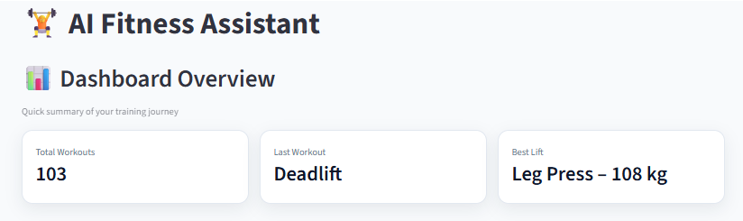
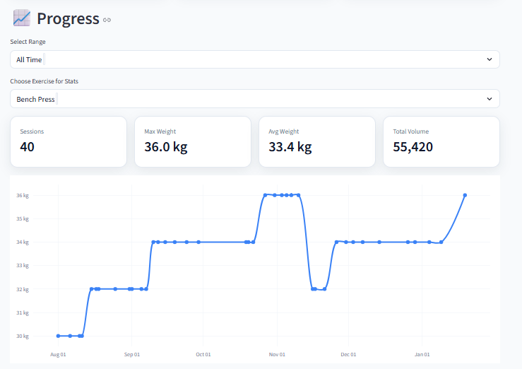
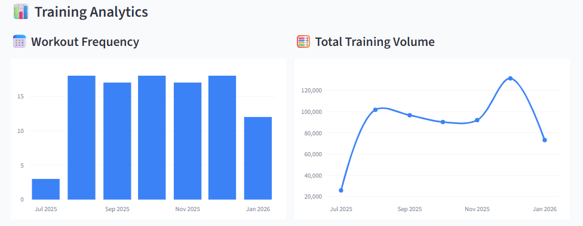
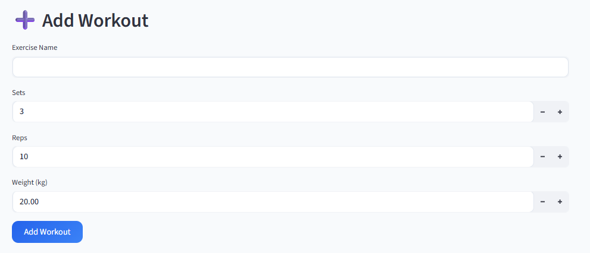
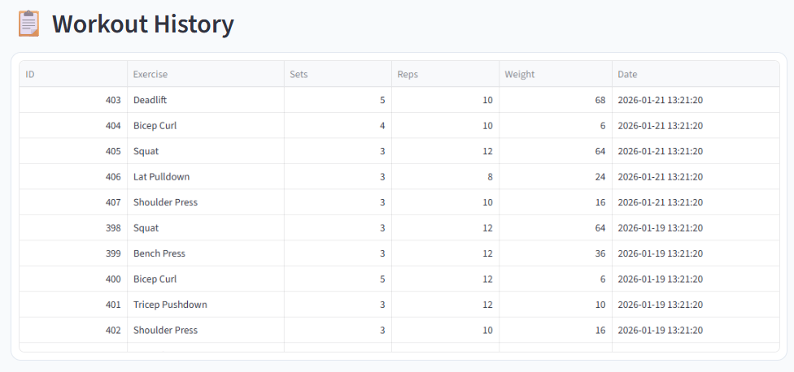
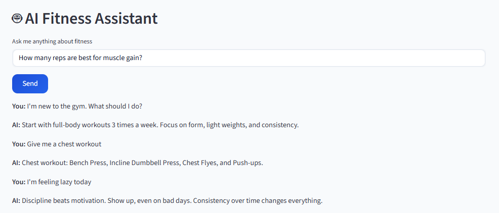

# 🏋️ AI Fitness Assistant

A full-stack fitness tracking web app with analytics and an AI-powered gym assistant.  
Built using Python, Streamlit, and SQLite.

This project helps users:
- Log workouts (exercise, sets, reps, weight)
- Track strength progression over time
- View training analytics (frequency & volume)
- Edit / delete workouts
- Export workout history
- Chat with an AI fitness coach

---

# 🚀 Features

- 📊 Dashboard Overview – Total workouts, last session, and best lift  
- 📈 Progress Tracking – Strength progression for each exercise  
- 📊 Training Analytics – Monthly workout frequency & volume  
- ➕ Add Workout – Log exercises with sets, reps, and weight  
- ✏️ Edit & Delete – Modify or remove past workouts  
- 📤 Export to CSV – Download workout history  
- 🤖 AI Fitness Assistant – Ask questions about workouts, reps, diet, and motivation  

---

# 🖼️ Screenshots

### Dashboard

### Progress Tracking

### Training Analytics

### Add Workout

### Workout History

### AI Assistant

---

# 🛠 Tech Stack

| Technology  | Purpose |
|-------------|---------|
| Python      | Core application logic |
| Streamlit   | Web UI & dashboard |
| SQLite      | Local database |
| Pandas      | Data processing for charts |
| Regex (re)  | Intent-based AI matching |
| Git & GitHub| Version control |

---

# ⚙️ How It Works

- Streamlit renders the UI
- User actions trigger Python logic
- Data is stored in SQLite
- Queries are converted into Pandas DataFrames
- Charts are generated in real time
- AI queries are matched using regex-based intent detection

---

